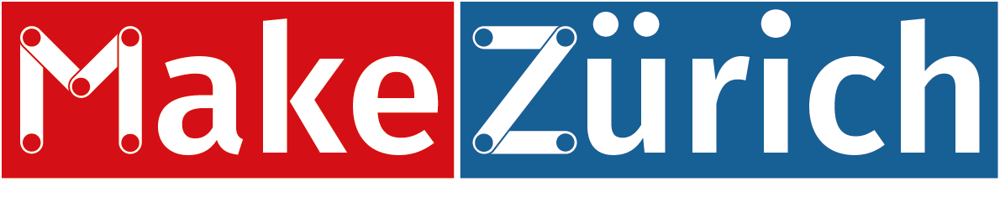
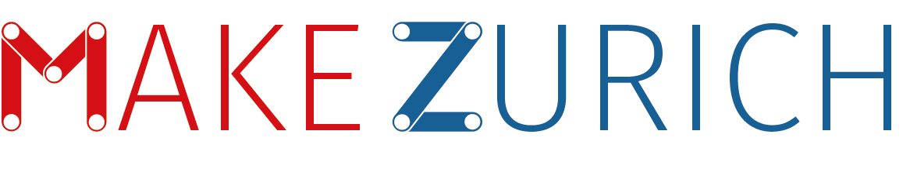
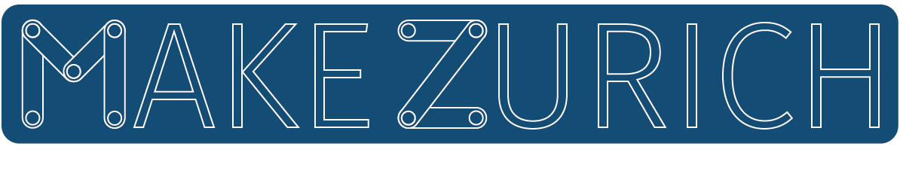
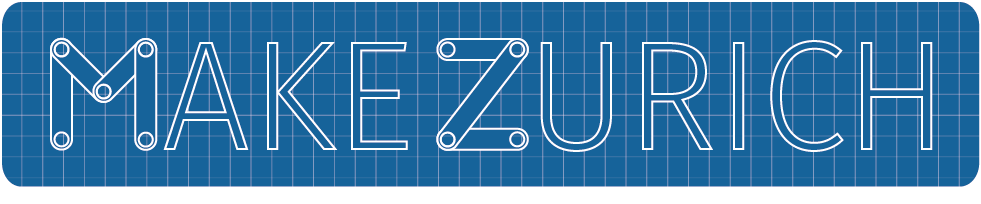
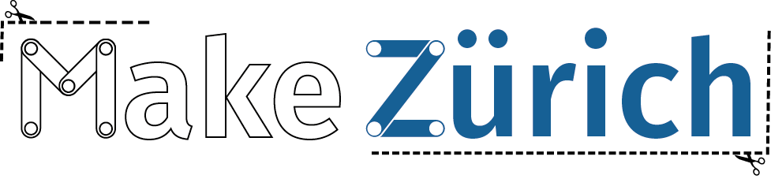
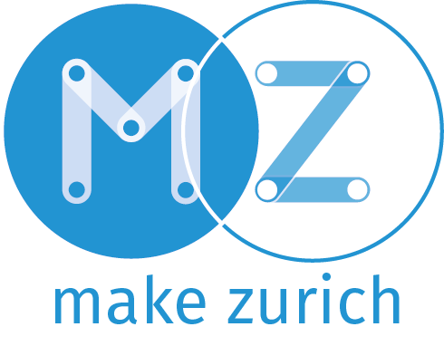

= Name/logo ideas

Here are some early drafts/ideas for a logo using the `Make Zurich` name:

=== AsciiDoctor Format

This document is written in the http://asciidoctor.org/docs/asciidoc-syntax-quick-reference/[AsciiDoctor] format. 
